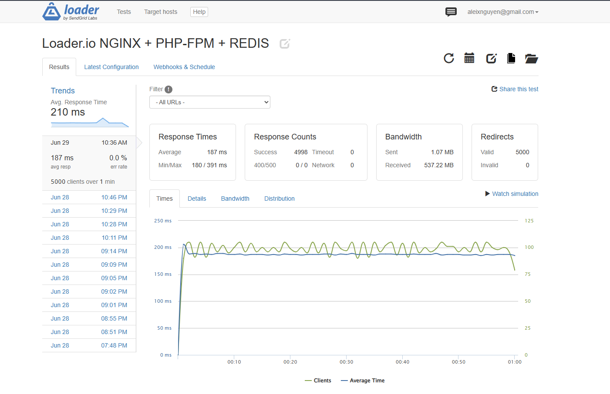
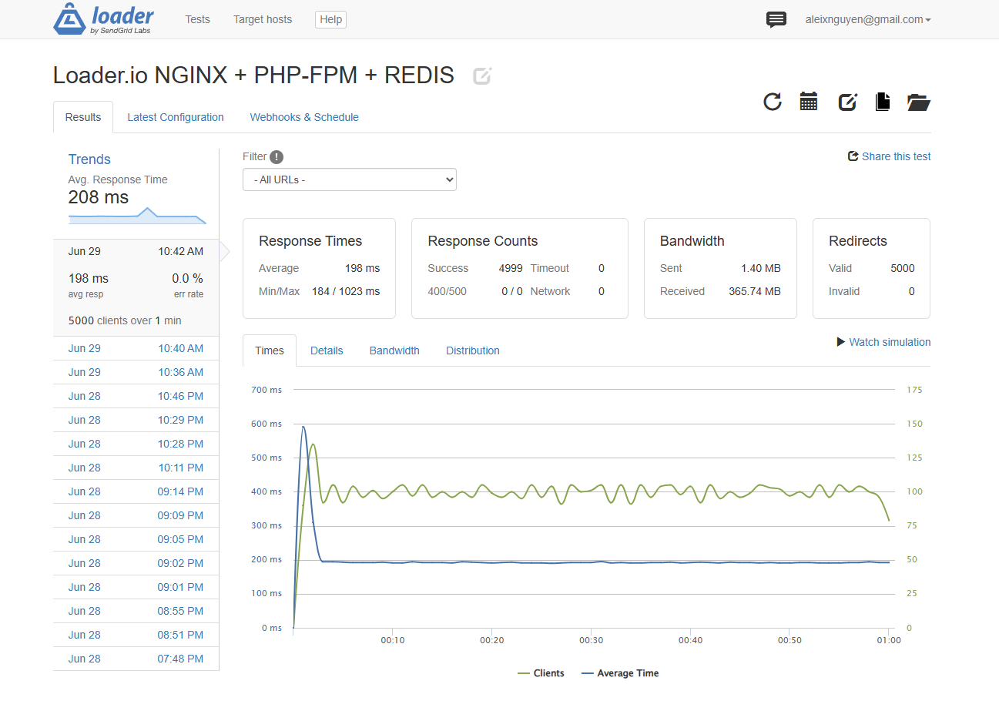
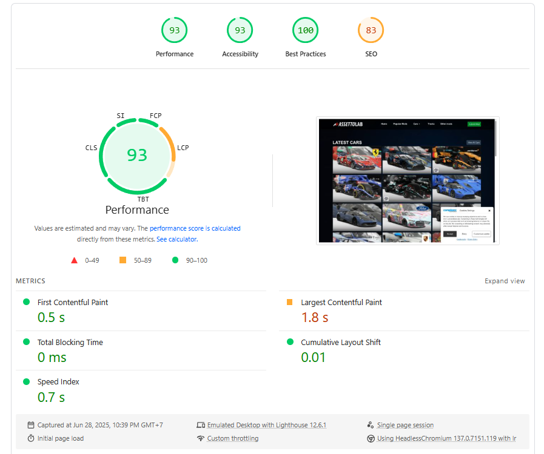
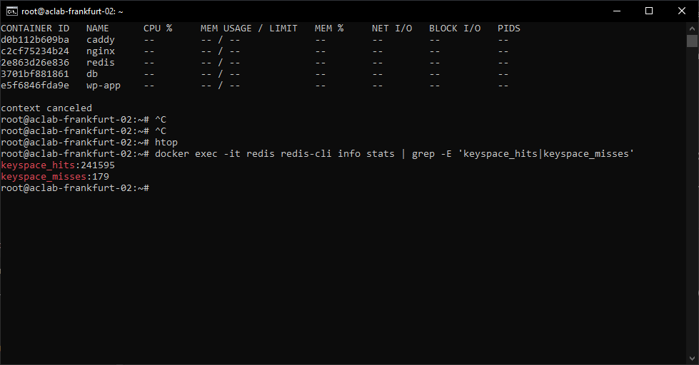
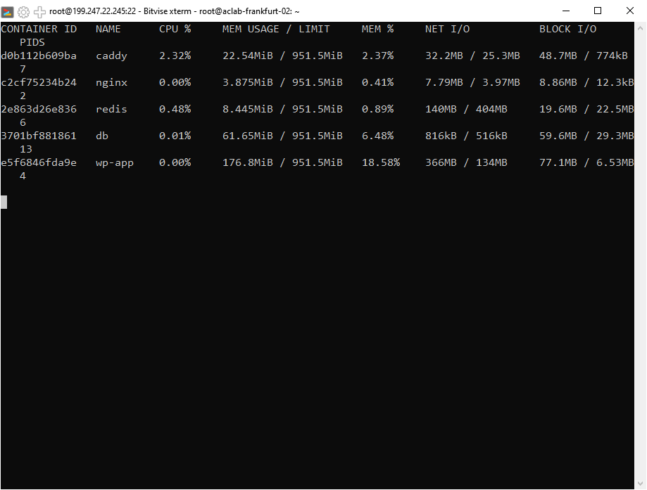
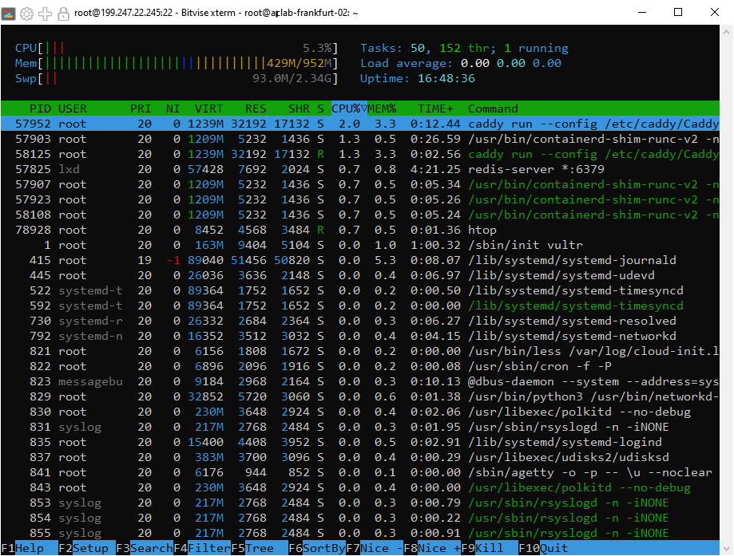
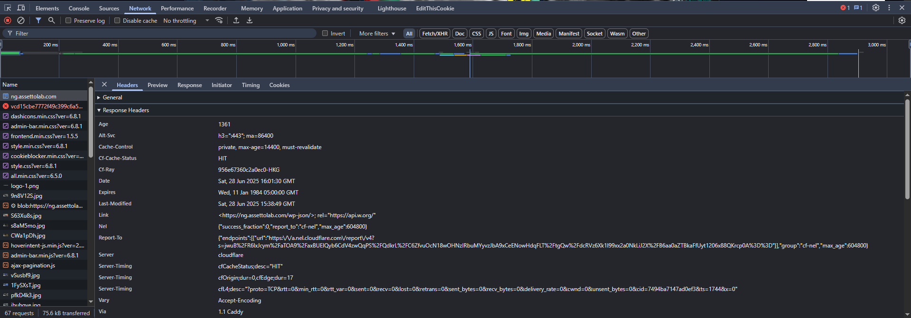
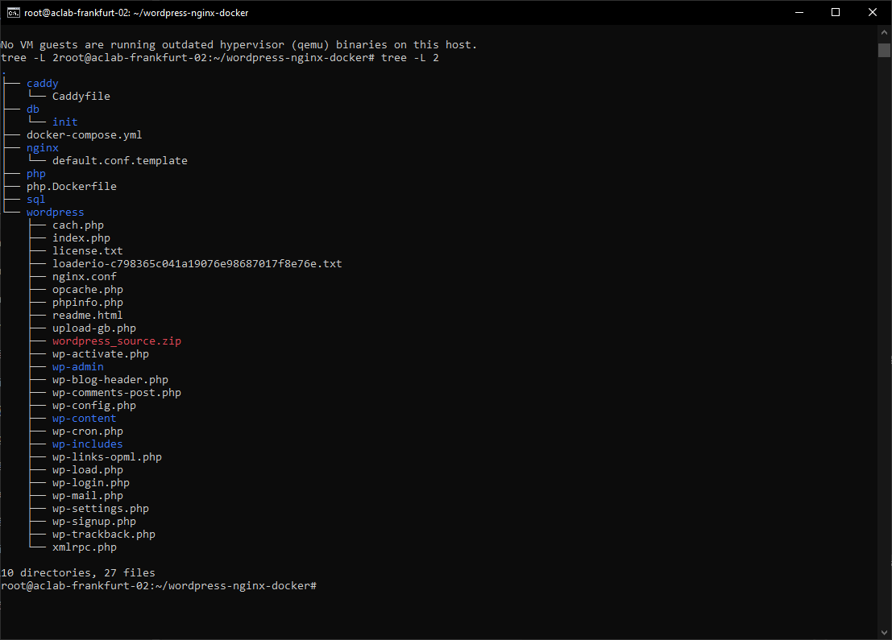
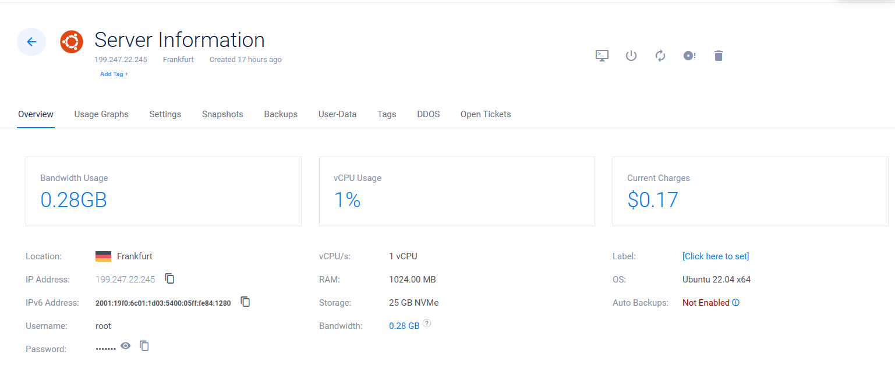

# 🎈 [CASE STUDY] WordPress on Docker: 5000 Client Benchmark on 1GB RAM VPS

> **"Optimizing WordPress at this level isn’t about plugins — it’s about removing bottlenecks one by one."**

&#x20;&#x20;

---

## 1. 📌 Objectives

- Run WordPress with Docker on a low-end VPS (1vCPU, 1GB RAM)
- Serve 5000 concurrent clients/minute
- Achieve 189ms average response time
- Use only free or open-source stack (Docker, Caddy, Redis, MariaDB)

---

## 2. ⚙️ Stack Overview

- **VPS**: Vultr 6$ VPS (1vCPU, 1GB RAM, 25GB SSD NVMe)
- **OS:** Ubuntu 22.04 LTS
- **Web Server:** NGINX (behind Caddy for HTTPS)
- **CMS:** WordPress (php8.2-fpm)
- **DB:** MariaDB 10.5
- **Cache:** Redis (Object Cache)
- **SSL Proxy:** Caddy (reverse proxy + HTTP/3)
- **CDN:** Cloudflare (free plan)

---

## 3. 💪 Key Optimizations

### 3.1 PHP-FPM Pool (wp-app)

```ini
pm = dynamic
pm.max_children = 4
pm.start_servers = 2
pm.min_spare_servers = 1
pm.max_spare_servers = 3
pm.max_requests = 500       ; auto recycle to avoid memory leak


; increased php execution timeout 
request_terminate_timeout = 30s
```

### 3.2 OPCache

```ini
opcache.enable=1
opcache.enable_cli=1
opcache.memory_consumption=128
opcache.interned_strings_buffer=16
opcache.max_accelerated_files=10000
opcache.validate_timestamps=0  ; if dont require hot reload file
opcache.revalidate_freq=60
```

### 3.3 Redis Configuration

```ini
maxmemory 256mb
maxmemory-policy allkeys-lru
```

- Redis as object cache for WordPress
- Hit rate: **99.93%**
- **No manual preload yet**, cache populated purely through real traffic

### 3.4 NGINX Performance

```nginx
gzip on;
gzip_disable "msie6";

gzip_vary on;
gzip_proxied any;
gzip_comp_level 5;               # 1 - 9(5 for best performance)
gzip_buffers 16 8k;
gzip_http_version 1.1;
gzip_min_length 256;

gzip_types
    text/plain
    text/css
    application/json
    application/javascript
    application/x-javascript
    text/xml
    application/xml
    application/xml+rss
    image/svg+xml;
```

### 3.5 Caddy for SSL

```text
example.com {
    reverse_proxy nginx:80 {
        header_up X-Forwarded-Proto https
    }

    encode gzip

    @static {
        path_regexp \.(jpg|jpeg|png|gif|ico|css|js|woff2?|ttf|svg)$
    }

    header @static {
        Cache-Control "public, max-age=31536000"
        Expires "Sun, 31 Dec 2037 23:55:55 GMT"
    }
}
```

---

## 4. 📊 Benchmark Results (Loader.io)

### Scenario:

- 5000 clients over 1 minute
- All requests to homepage (cached via Redis)

| Metric            | Value                     |
| ----------------- | ------------------------- |
| Avg Response Time | **189ms**                 |
| Redis Hit Rate    | **99.93%**                |
| Success Rate      | **100%**                  |
| Max Latency       | 486ms                       |
| RAM Usage (peak)  | **\~451MB**               |
| CPU               | 2-6% |
| Errors / Timeouts | **0**                     |

> 🚀 Even at 5000 users/minute, no Redis or MySQL bottlenecks were observed. Cache was warmed purely by live traffic.

---

## 5. 🏆 Summary

- Dockerized WordPress stack on 1vCPU/1GB RAM VPS
- No paid services: all open-source or free-tier
- Redis cache hit 241,595 / 179 → **99.93%** hit rate
- Caddy offloaded SSL + HTTP/3
- Cloudflare added as CDN layer (compression + edge cache)

### Result:

> 🌟 **5000 concurrent users** served in 1 minute at **187ms average**, no crash, no errors. RAM used: **\~431MB**.

---

## 6. 🖼 Some screenshots

Below are key screenshots capturing performance results and system metrics during the tests.

### 🔹 1. Loader.io Benchmark – 5000 Users,

#### 🧪 Scene 1 – Warm cache, optimal performance

>**Final round**:<br>
5,000 concurrent users · 187ms avg · 0% errors · 100% valid redirects<br>
Max latency only 391ms — demonstrates steady-state performance under full load.

#### 🧊 Scene 2 – Cold start (post page)


>Real-world uncached access: 198ms avg, 0% errors
Shows how the stack handles cache-warming and first-hit scenarios with zero degradation.

---

### 🔹 2. 93 Google Lighthouse Score


>Score: 93/100 (Desktop)
Minimal layout shift, optimized loading.
cf-cache-status: HIT, HTML gzip, no render-blocking JS.

> ⚠️ Note: idk why Pingdom score stuck at **87/100** despite full gzip and cache header tuning — likely due to CDN location and test heuristics.

---

### 🔹 3. Redis Hit Rate


*241,595 cache hits vs. 179 misses — 99.93% hit rate without preload.*

---

### 🔹 4. Docker Stats + `htop` During Load Test




>RAM usage: ~431MB peak<br>
All services stayed under control, including PHP-FPM, Redis, MariaDB<br>
Swap barely touched, CPU stable at 2–6%

---

### 🔹 5. Chrome DevTools: Network Tab


>✅ cf-cache-status: HIT<br>
✅ gzip enabled<br>
✅ HTTP/3 from Caddy<br>
TTFB under 200ms, total load <2s across 67 assets.

---

### 🔹 6. Folder Structure / Project Layout


*Modular Docker-based layout with isolated services and shared volumes.*

### 🖥 7. Server Specs – Vultr 1GB VPS

  
> Benchmark environment: Vultr 1vCPU / 1GB RAM VPS (Frankfurt). Stack deployed on Ubuntu 22.04 with Docker. Current cost: $0.07.*

---

_For more screenshots of alternative configs and test iterations, browse the full `/screenshots` folder in the repository._

## 7. 📆 Future Improvements

- Add FastCGI Cache (NGINX-level full page caching)
- Integrate GitHub Actions to trigger Redis preload after deploy
- Explore ESI + Edge Caching (via QUIC.cloud or Cloudflare Workers)
- Auto-monitor Redis hit rate and auto-flush if fallback detected

---

## 8. 💼 Repository & Source Code

> [https://github.com/aleixnguyen-vn/docker-wordpress-performance](https://github.com/aleixnguyen-vn/docker-wordpress-performance)

---

> ⏱️ I picked up Docker at 2PM. This stack was live — and benchmarking — before midnight.
> 🔊 "You don't need a bigger server. You need better config."
