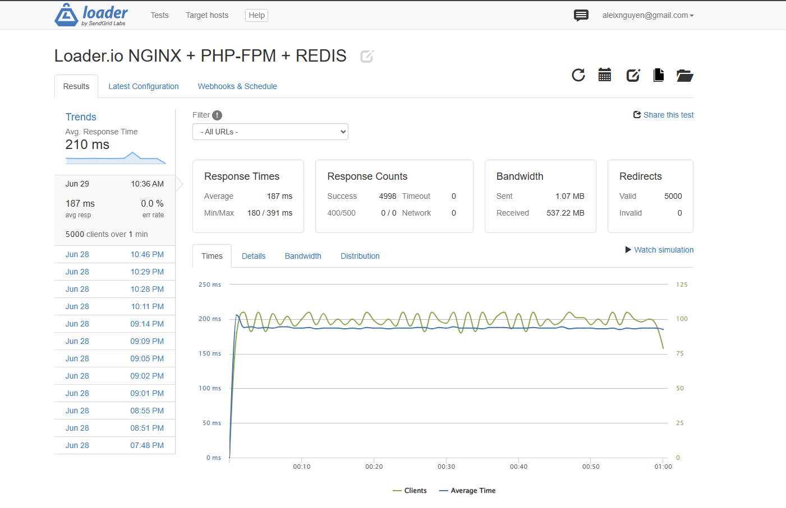
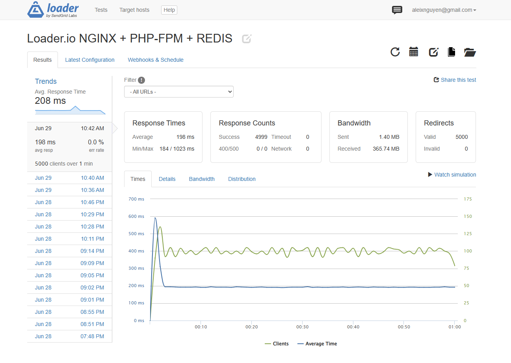
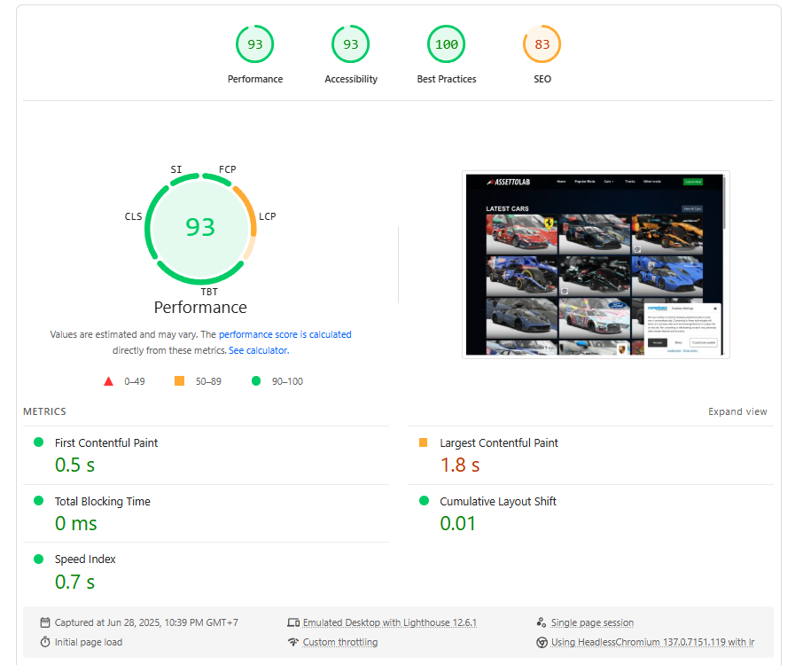
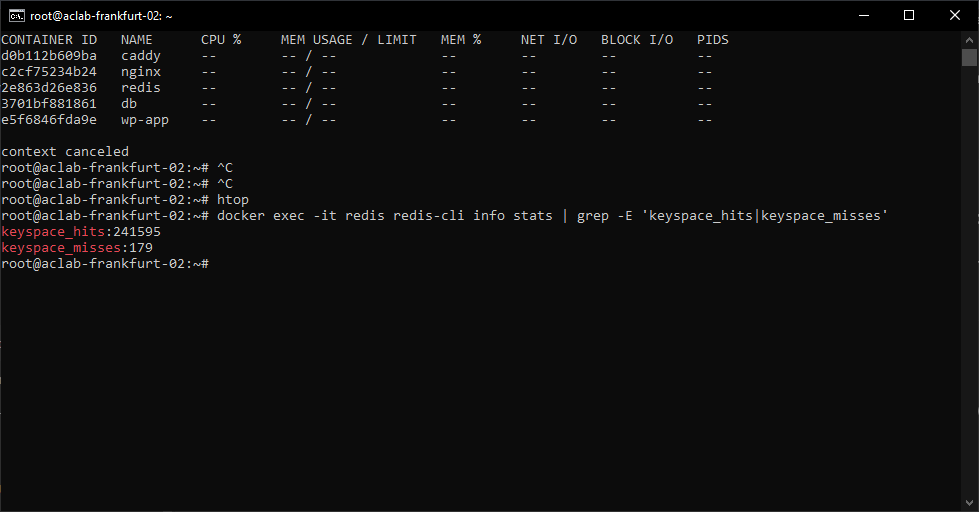
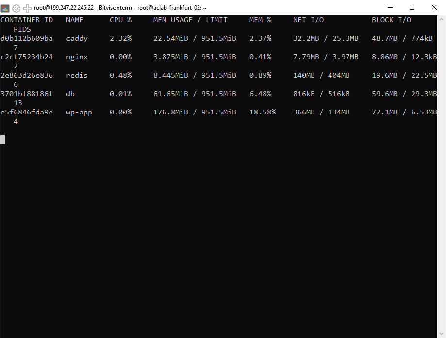
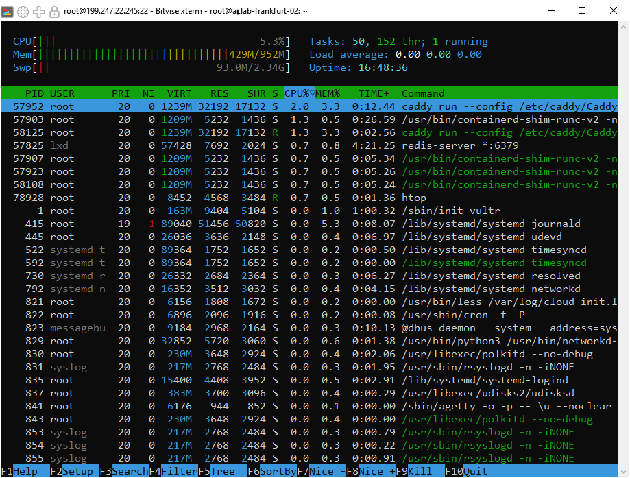
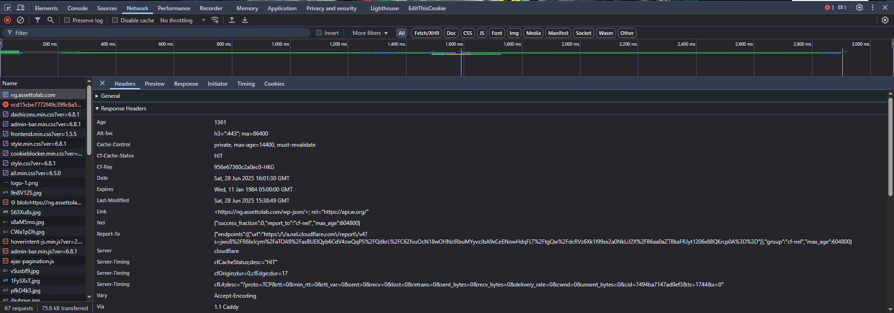
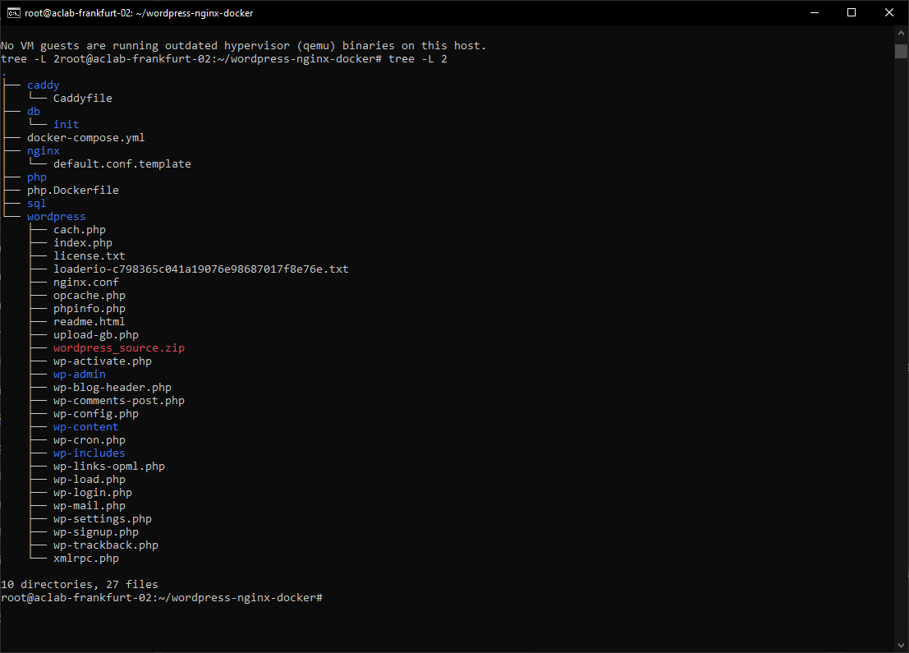
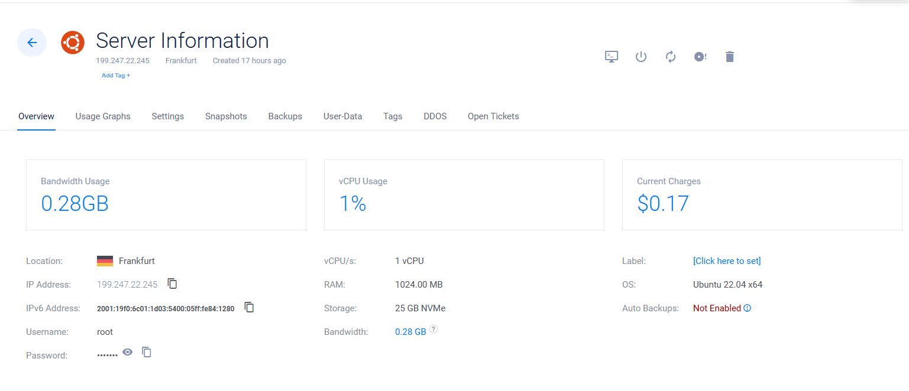

# [CASE STUDY] WordPress on Docker: 5000 Client Benchmark on 1GB RAM VPS
> 🚨 **NOTE**: 
This repository (v2.0) is now deprecated and preserved for archive purposes only. The architecture has been completely upgraded to **v3.5**, more practical and effiency solution.
>
New repo: 🔗 **[Content Distribution Platform Infrastructure on 5.78EUR VPS](https://github.com/aleixnguyen-vn/simracing-community-platform-stack)**
---

## 1. ⚙️ Stack Overview

- **VPS**: Vultr 6$ VPS (1vCPU, 1GB RAM, 25GB SSD NVMe)
- **OS:** Ubuntu 22.04 LTS
- **Web Server:** NGINX (behind Caddy for HTTPS)
- **CMS:** WordPress (php8.2-fpm)
- **DB:** MariaDB 10.5
- **Cache:** Redis (Object Cache)
- **SSL Proxy:** Caddy (reverse proxy + HTTP/3)
- **CDN:** Cloudflare (free plan)

---

## 2. 📊 Benchmark Results (Loader.io)

### Scenario:

- 5000 clients over 1 minute
- All requests to homepage (cached via Redis)

| Metric            | Value                     |
| ----------------- | ------------------------- |
| Avg Response Time | **189ms**                 |
| Redis Hit Rate    | **99.93%**                |
| Success Rate      | **100%**                  |
| Max Latency       | 486ms                       |
| RAM Usage (peak)  | **\~451MB**               |
| CPU               | 2-6% |
| Errors / Timeouts | **0**                     |

> 🚀 Even at 5000 users/minute, no Redis or MySQL bottlenecks were observed. Cache was warmed purely by live traffic.

---

## 3. 🏆 Summary

- Dockerized WordPress stack on 1vCPU/1GB RAM VPS
- No paid services: all open-source or free-tier
- Redis cache hit 241,595 / 179 → **99.93%** hit rate
- Caddy offloaded SSL + HTTP/3
- Cloudflare added as CDN layer (compression + edge cache)

### Result:

> 🌟 **5000 concurrent users** served in 1 minute at **187ms average**, no crash, no errors. RAM used: **\~431MB**.

---

## 4. 🖼 Some screenshots

Below are key screenshots capturing performance results and system metrics during the tests.

### 🔹 1. Loader.io Benchmark – 5000 Users,

#### 🧪 Scene 1 – Warm cache, optimal performance

>**Final round**: 
5,000 concurrent users · 187ms avg · 0% errors · 100% valid redirects 
Max latency only 391ms — demonstrates steady-state performance under full load.

#### 🧊 Scene 2 – Cold start (post page)

>Real-world uncached access: 198ms avg, 0% errors
Shows how the stack handles cache-warming and first-hit scenarios with zero degradation.

---

### 🔹 2. 93 Google Lighthouse Score

>Score: 93/100 (Desktop)
Minimal layout shift, optimized loading.
cf-cache-status: HIT, HTML gzip, no render-blocking JS.

> ⚠️ Note: idk why Pingdom score stuck at **87/100** despite full gzip and cache header tuning — likely due to CDN location and test heuristics.

---

### 🔹 3. Redis Hit Rate

*241,595 cache hits vs. 179 misses — 99.93% hit rate without preload.*

---

### 🔹 4. Docker Stats + `htop` During Load Test

>RAM usage: ~431MB peak 
All services stayed under control, including PHP-FPM, Redis, MariaDB 
Swap barely touched, CPU stable at 2–6%

---

### 🔹 5. Chrome DevTools: Network Tab

>✅ cf-cache-status: HIT 
✅ gzip enabled 
✅ HTTP/3 from Caddy 
TTFB under 200ms, total load <2s across 67 assets.

---

### 🔹 6. Folder Structure / Project Layout

*Modular Docker-based layout with isolated services and shared volumes.*

### 🖥 7. Server Specs – Vultr 1GB VPS

  
> Benchmark environment: Vultr 1vCPU / 1GB RAM VPS (Frankfurt). Stack deployed on Ubuntu 22.04 with Docker. Current cost: $0.07.*

---

_For more screenshots of alternative configs and test iterations, browse the full `/screenshots` folder in the repository._

## 4. 📆 Future Improvements

- Add FastCGI Cache (NGINX-level full page caching)
- Integrate GitHub Actions to trigger Redis preload after deploy
- Explore ESI + Edge Caching (via QUIC.cloud or Cloudflare Workers)
- Auto-monitor Redis hit rate and auto-flush if fallback detected

---

## 5. 💼 Repository & Source Code

> [https://github.com/aleixnguyen-vn/docker-wordpress-performance](https://github.com/aleixnguyen-vn/docker-wordpress-performance)
